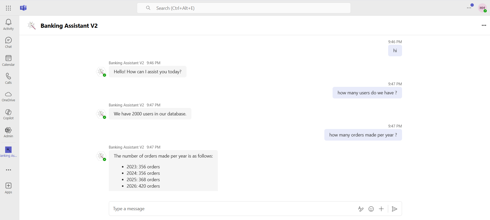
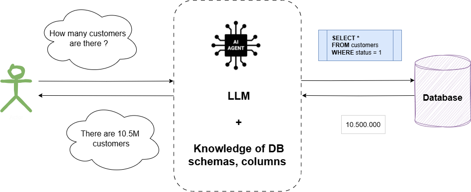
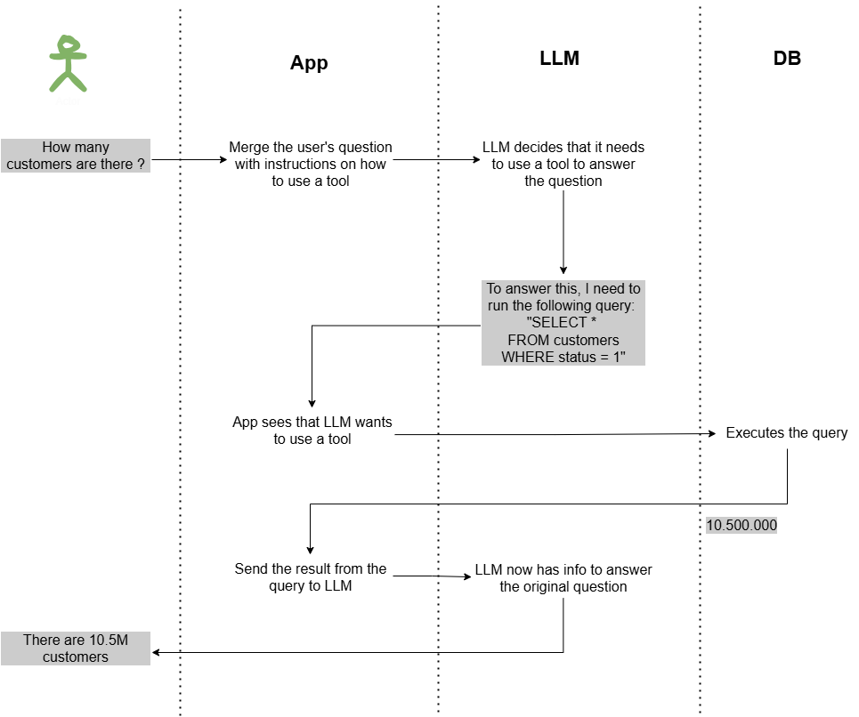
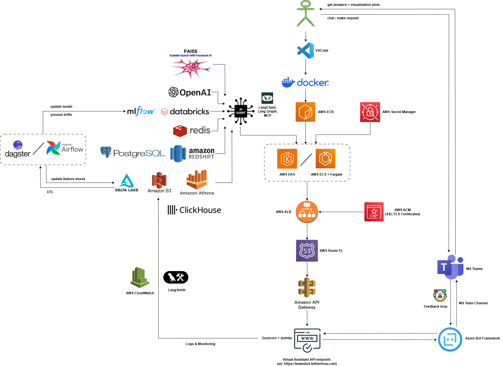

# 💬 AI Assistant on Microsoft Teams

An intelligent chatbot integrated into Microsoft Teams, powered by OpenAI and LangChain for conversational interaction, data analysis, and visualization.

# 🚀 PART 1. DEMO 


<div align="center">

</div>


## 🔶 1. Key Features

### 🤖 LLM Chat

* Uses `ChatOpenAI` from LangChain.
* Natural language interaction with conversation memory.
* Capable of answering questions across various domains.

### 🧠 User-Specific Conversation Memory

* Each user has a dedicated `ConversationBufferMemory`.
* Maintains conversation context for more natural responses.

### 📊 Text-to-SQL Tool (Text2SQL)

* Users can ask questions in natural language such as:
  `"What is the total products per month?"`
* The bot automatically converts this to SQL, queries the database, and returns results.
* Especially useful for analytics, finance, and accounting teams.

### 📈 Table, HTML and Chart Generation from Data

* The bot can generate table, html / charts directly from query results or uploaded datasets.
* Charts are automatically created and **sent as images into Microsoft Teams**.

### 🔐 User Authentication via Teams ID

* Uses `turn_context.activity.from_property.id` to identify the user.
* No extra login needed – seamlessly integrated with the current Teams account.

### ⚙️ Easily Extendable via LangChain Tools

* The system is designed for easy integration of new tools: celery task, redis memory, retriever, vector search, agent, planner, etc.


## 🔶 2. Key Architecture Explanations

Basically, Text2SQL component works as follows:

<div align="center">

</div>

<br/>

If we want to dive deeper into the underlying mechanisms, here how each component interacts with each other:

<div align="center">

</div>

## 🔶 3. Project Structure

```
msteams/
├── manifest.json         # Manifest for MS Teams App
src/
├── llm_confg/            # Prompt templates & params for LLM
├── tools/                # LLM tools
    ├── sql.py            # Perform SQL query
    ├── report.py         # Make HTML report
    ├── chart.py          # Make visualization chart (bar, line,...)
├── app.py                # Entry point for aiohttp server
├── handler.py            # LangChainBot logic & adapter
├── config.py             # Config (API key, Redis, Teams App ID)
├── db.sqlite             # SQLite DB with 6 example tables: users, addresses, products, carts, orders, order_products
├── requirements.txt      # Python lib packages need to be installed
Dockerfile                # Dockerfile for deployment 
README.md                 # Documentation
```


## 🔶 4. Deployment

### A. Run Locally

#### Install dependencies:

```bash
pip install -r src/requirements.txt
```

#### Start the server:

```bash
gunicorn --bind=0.0.0.0:3978 --worker-class=aiohttp.worker.GunicornWebWorker --timeout=600 app:app
```


### B. Deploy on AWS

Authen AWS:

```
aws configure
aws ecr get-login-password --region ap-southeast-2 | docker login --username AWS --password-stdin 567749996008.dkr.ecr.ap-southeast-2.amazonaws.com
```

Then:

```bash
docker build -t teamsbot-aws .
docker tag teamsbot-aws:latest 567749996008.dkr.ecr.ap-southeast-2.amazonaws.com/teamsbot-aws:latest
docker push 567749996008.dkr.ecr.ap-southeast-2.amazonaws.com/teamsbot-aws:latest
```

**Note:**

* Before pushing to ECS, you can test locally using:
  `docker run -it -v /home/<user>/ngrok_logs:/src/ngrok_logs -p 3978:3978 teamsbot-aws:latest`
* To quickly expose the API endpoint for development testing:
  `ngrok http 3978 --log=stdout > ngrok_logs/ngrok.log 2>&1`


### C. Register Bot with Microsoft Teams:

1. Log into [Azure Portal](https://portal.azure.com) using your enterprise MS account (`xxx@<your_domain>.onmicrosoft.com`) and create an Azure Bot.
2. Set the bot endpoint to:
   `https://<your-domain>/api/messages`
3. Add the Microsoft Teams channel to the Azure Bot. You can test if the API endpoint is working under Settings > Test in Web Chat.
4. Upload the bot app to Teams using the `msteams/msteams.zip` package.


### D. Sample Prompt (Text2SQL)

> "Show me the top 5 products people ordered"

The bot will auto-generate SQL like:

```sql
SELECT product_id, SUM(amount) as total_amount 
FROM order_products 
GROUP BY product_id 
ORDER BY total_amount 
DESC LIMIT 5;
```


<br>
<br>
<br>


# PART 2. Architecture Design

<div align="center">

</div>


## 🔶 1. Key Architecture Components and Explanations

### ✅ A. Microsoft Teams Bot Interface

**Function**:
Main user interface for business teams to ask questions, retrieve data, or receive automated insights.

**Features**:

* Natural language Q\&A (powered by LLM via LangChain)
* Button-driven dashboards for frequently asked queries
* Push notifications (e.g., anomaly alerts or opportunity suggestions)


### ✅ B. API Gateway (Amazon API Gateway + Route 53)

**Function**:

* Routes user requests from Microsoft Teams to backend LLM services
* Handles authentication 
* Adds support for versioning, throttling, and public/private endpoints


### ✅ C. Intelligent Query & Insight Engine

**LLM Orchestration Layer**:

* Built with **LangChain**, **OpenAI GPT** / **finetune LLM**
* Translates natural language into semantic SQL queries or invokes pre-defined pipelines

**Intent & Context Detection**:

* Understands business questions such as
  *"Which B2B customers have high revenue but low digital engagement?"*


### ✅ D. Semantic Layer (Customer 360 Ontology)

**Function**:

* Defines consistent business-friendly terms (e.g., `customer`, `segment`, `revenue`, `churn_risk`)
* Built using **Semantic Layer** or tools like **Dagster** or **Airflow** over Delta Lake

**Benefits**:

* Ensures data consistency across teams
* Centralized governance of KPIs and metrics


### ✅ E. Insight Generation Engine

**ML Models**:

* Churn prediction
* Cross-sell recommendation
* Opportunity detection

**Rules Engine**:

* Implements business rules (e.g., “3-month inactivity + high balance → flag as dormant”)

**Databricks Feature Store**:

* Stores reusable features and model outputs for scoring and retraining


### ✅ F. Databricks Lakehouse Platform

**Delta Lake Tables**:

* Stores curated domain-specific data (e.g., CIC, Finance, Procurement)

**Pipelines**:

* Built using **Databricks Workflows** and orchestrated by **Airflow/Dagster**

**Access**:

* Exposes data via **Unity Catalog** and **SQL Endpoints**
* Used directly by the LLM agent and BI tools


## 🔶 2. Data Flow Overview

1. **User Input**
   User opens Microsoft Teams and types:
   *"Show me all B2B customers with high revenue but low online usage."*

2. **Intent Parsing**
   The LLM interprets user intent and maps it to business terms defined in the Semantic Layer.

3. **Query Generation**
   The system generates a SQL query or invokes a relevant saved model pipeline.

4. **Data Retrieval**
   Queries Delta Lake or Feature Store to fetch the required data.

5. **Insight Delivery**
   Result is returned to Teams as:

   * A dynamic table
   * Visualization/chart
   * Insight summary (*e.g., "120 clients meet criteria. Suggest activating online engagement."*)

6. **Optional Action**
   Push result to CRM or marketing automation platform for activation.


## 🔶 3. Resources Required

### ✅ A. Tools & Platforms

| Category             | Tools Used                                                      |
| -------------------- | --------------------------------------------------------------- |
| **Cloud Platform**   | AWS (S3, API Gateway, ECS/EKS, ACM, Route 53, CloudWatch)       |
| **Lakehouse & ETL**  | Databricks (Delta Lake, MLflow, Feature Store), Airflow/Dagster |
| **LLM Engine**       | OpenAI GPT / Databrick LLM model + LangChain                    |
| **Monitoring**       | AWS CloudWatch, LangSmith                                       |
| **Bot + UI**         | Microsoft Teams + Azure Bot Framework                           |
| **Deployment Tools** | Docker + Gunicorn + aiohttp                                     |


### ✅ B. Team Roles

| Role                   | Responsibilities                                        |
| ---------------------- | ------------------------------------------------------- |
| **Data Engineer**      | Build & maintain Lakehouse pipelines and infrastructure |
| **Data Scientist**     | Build ML models for churn, upsell, etc.                 |
| **LLM Engineer**       | Prompt design, tool integration, retrieval logic        |
| **Platform Engineer**  | Setup CI/CD, access control, Docker/AWS infra           |
| **Business Analyst**   | Design workflows, user journey, KPI logic               |
| **Project Manager**    | Manage timelines, roadmap, and stakeholder alignment    |


## 🔶 4. Implementation Roadmap

| Phase       | Deliverables                                                                 |
| ----------- | ---------------------------------------------------------------------------- |
| **Phase 1** | MVP bot, data lake consolidation, basic pipeline setup                       |
| **Phase 2** | Semantic layer, LLM Q&A interface, anomaly detection alerts                  |
| **Phase 3** | ML models for opportunity scoring, churn prediction, segment recommendations |
| **Phase 4** | Monitoring, feedback loop, user training & adoption program                  |


## 🔶 5. Expected Benefits

* ❌ No more Excel merging across departments
* 🔁 Unified Customer 360 view across multiple domains
* ⚡ Instant access to insights via natural language
* 🎯 Personalized and contextual answers
* 🙋 Empowered business teams with self-service tools
* 🚀 Scalable and intelligent foundation for AI-first decision-making